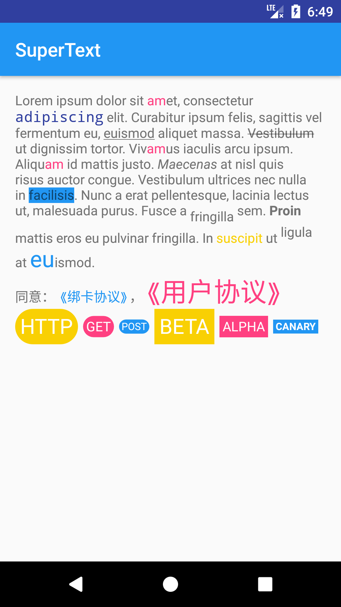

# textView-Helper

### Useage

```java
TextView tv = (TextView) findViewById(R.id.textView);

String str = "Lorem ipsum dolor sit amet, consectetur adipiscing elit. " +
                "Curabitur ipsum felis, sagittis vel fermentum eu, euismod aliquet massa. " +
                "Vestibulum ut dignissim tortor. Vivamus iaculis arcu ipsum. " +
                "Aliquam id mattis justo. Maecenas at nisl quis risus auctor congue. " +
                "Vestibulum ultrices nec nulla in facilisis. Nunc a erat pellentesque, lacinia lectus ut, malesuada purus. " +
                "Fusce a fringilla sem. Proin mattis eros eu pulvinar fringilla. In suscipit ut ligula at euismod.";

TextViewStyleHelper.with(this, str)
            .every("am")
            .textColor(getColorCompat(R.color.colorAccent))

            .first("adipiscing")
            .textColor(getColorCompat(R.color.colorPrimaryDark))
            .font("monospace")
            .scale(1.1f)

            .last("eu")
            .textColor(getColorCompat(R.color.colorPrimary))
            .size(24)

            .last("Proin")
            .bold()

            .first("Maecenas")
            .italic()

            .first("facilisis")
            .background(getColorCompat(R.color.colorPrimary))

            .first("Vestibulum")
            .strikethrough()

            .first("fringilla")
            .subscript()

            .first("ligula")
            .superscript()

            .first("euismod")
            .underline()

            .between("In", "ut")
            .textColor(getColorCompat(R.color.mainText))
            .into(tv);
```



### todo

- release to maven

### thanks
- [SimpleText](https://github.com/jaychang0917/SimpleText)

